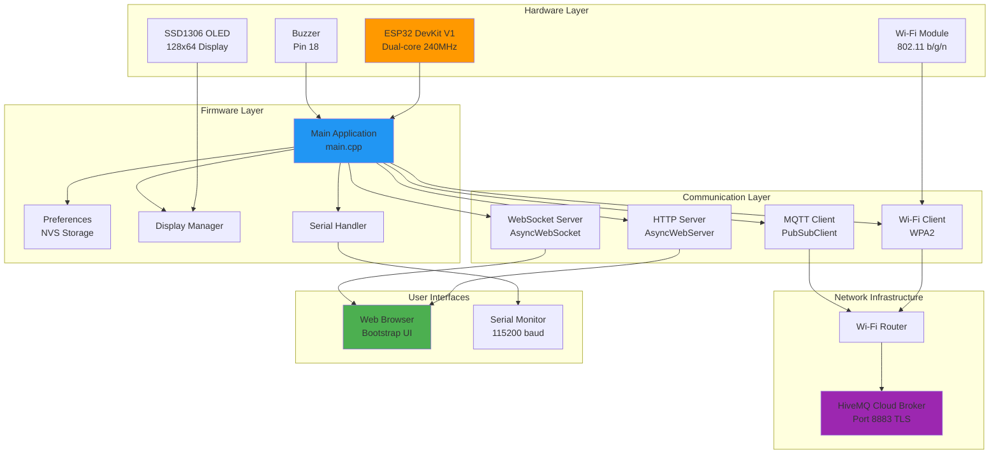
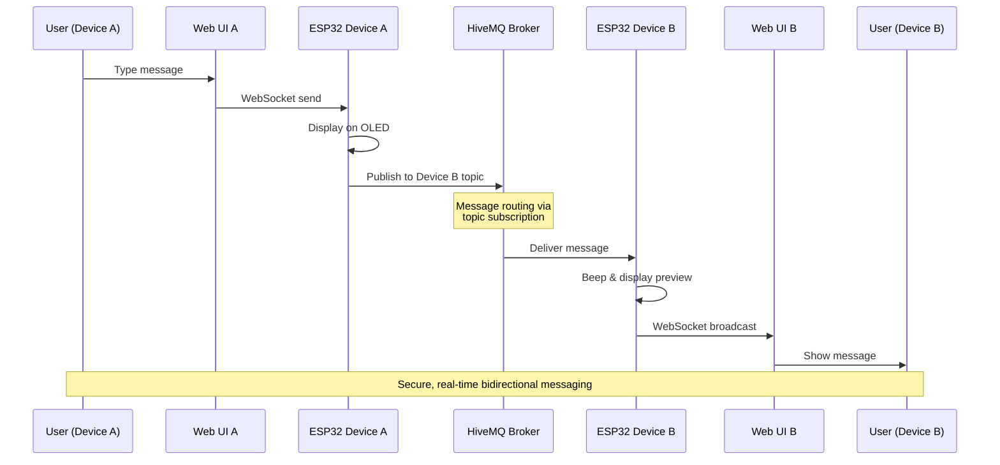
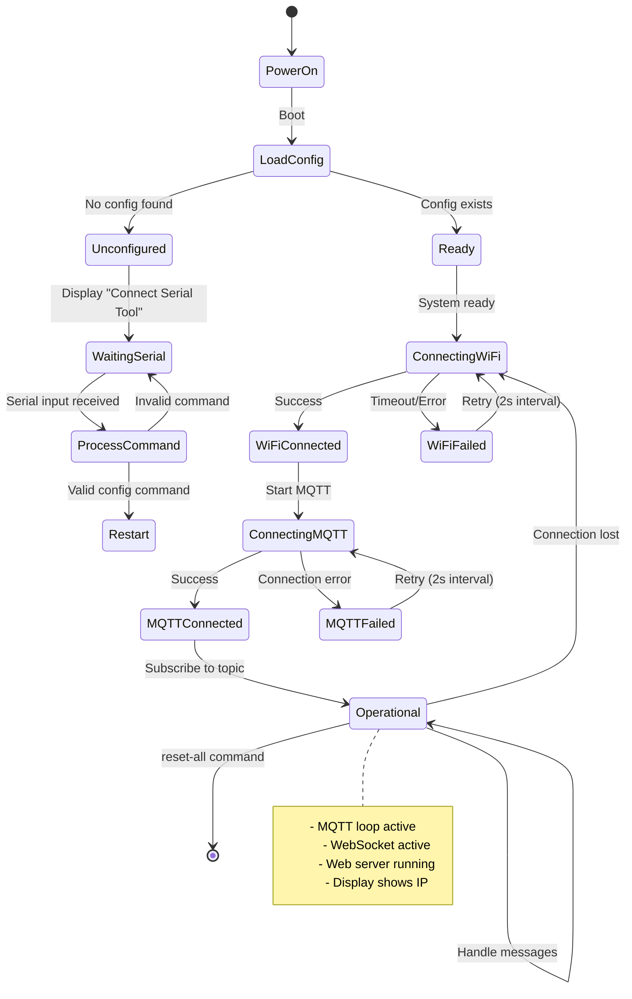
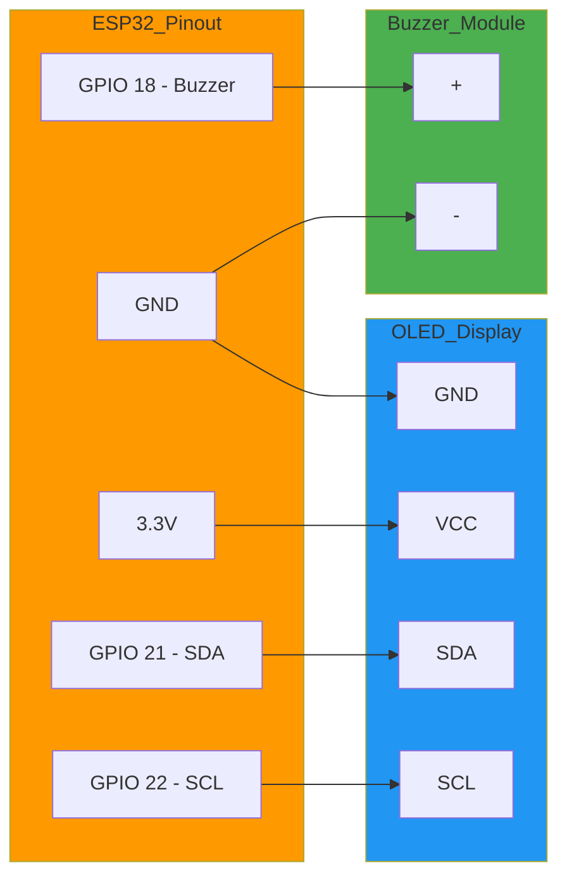
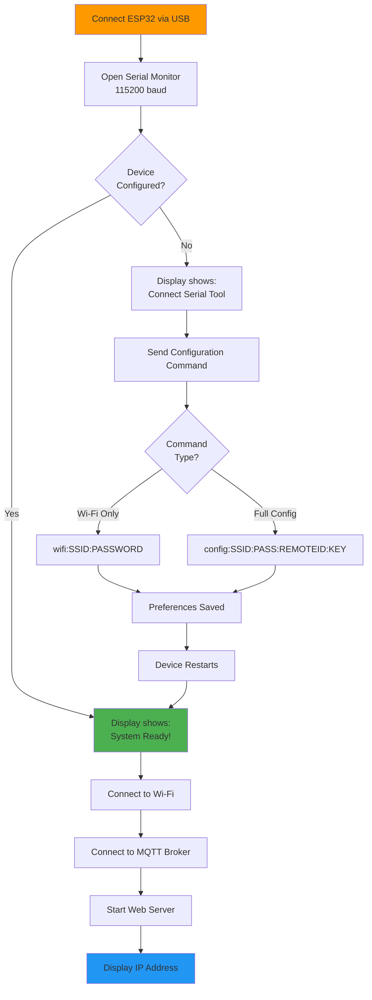
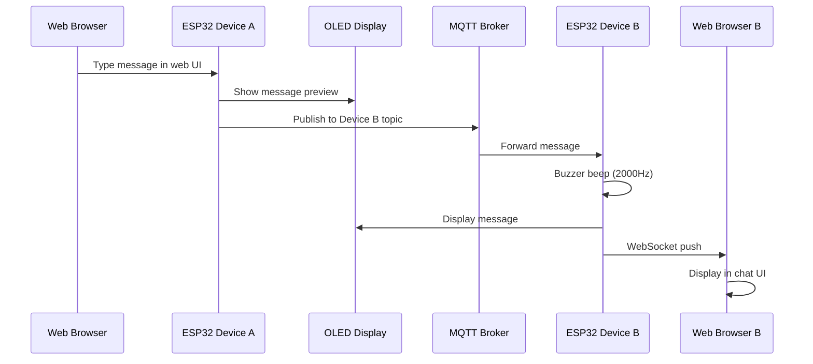
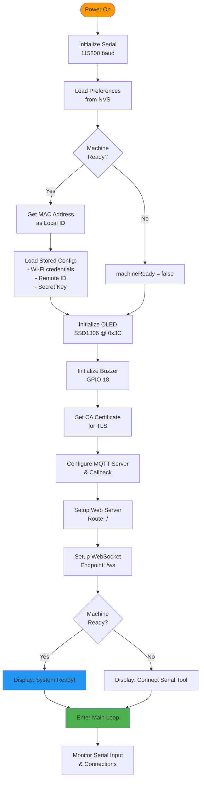

# 🔐 Enigma Machine - IoT Secure Messaging System

<div align="center">

[](https://platformio.org/)
[](https://www.arduino.cc/)
[](https://mqtt.org/)
[](LICENSE)

*A distributed, IoT-based secure messaging system powered by ESP32 microcontrollers*

</div>

---

## 📋 Table of Contents

- [Overview](#-overview)
- [Architecture](#-architecture)
- [System Components](#-system-components)
- [Hardware Requirements](#-hardware-requirements)
- [Software Dependencies](#-software-dependencies)
- [Installation](#-installation)
- [Configuration](#-configuration)
- [Usage](#-usage)
- [Communication Flow](#-communication-flow)
- [Web Interface](#-web-interface)
- [Troubleshooting](#-troubleshooting)
- [Technical Details](#-technical-details)

---

## 🎯 Overview

**Enigma Machine** is a modern IoT messaging platform that enables secure, real-time communication between ESP32-powered devices. Despite its name referencing the historical WWII cipher machine, this project is a contemporary distributed messaging system leveraging MQTT protocol, WebSocket technology, and embedded systems programming.

### Key Features

- 🔒 **Secure MQTT Communication** - TLS/SSL encrypted messaging via HiveMQ Cloud broker
- 📱 **Web-Based Interface** - Browser-accessible chat UI with real-time updates
- 🔌 **Device Pairing** - Direct peer-to-peer messaging between paired ESP32 devices
- 📟 **OLED Display** - Real-time status and message preview on 128x64 screen
- 🔊 **Audio Feedback** - Buzzer alerts for connection status and incoming messages
- 💾 **Persistent Configuration** - Non-volatile storage for Wi-Fi credentials and pairing info
- 🌐 **WebSocket Support** - Real-time bidirectional communication with web clients
- ⚙️ **Serial Configuration** - Easy setup via serial commands without code changes

---

## 🏗️ Architecture

The Enigma Machine follows a layered architecture combining embedded hardware, network protocols, and web technologies:



### Architecture Layers Explained

1. **Hardware Layer**: Physical components including the ESP32 microcontroller, OLED display for visual feedback, and buzzer for audio alerts.

2. **Firmware Layer**: Core application logic handling device initialization, configuration management, display rendering, and serial command processing.

3. **Communication Layer**: Protocol implementations for MQTT messaging, HTTP web serving, WebSocket real-time communication, and Wi-Fi connectivity.

4. **Network Infrastructure**: External services including the local Wi-Fi router and HiveMQ Cloud MQTT broker for message routing.

5. **User Interfaces**: Multiple interaction points including a web-based chat interface and serial terminal for configuration.

---

## 🔄 System Components

### Message Flow Architecture

The following diagram illustrates how messages flow through the system from sender to receiver:



### State Machine Diagram



---

## 🛠️ Hardware Requirements

### Required Components

| Component | Specification | Quantity | Purpose |
|-----------|--------------|----------|---------|
| **ESP32 DevKit V1** | Dual-core Xtensa LX6, 240MHz, 520KB RAM | 2 | Main microcontroller (one per device) |
| **SSD1306 OLED Display** | 128x64 pixels, I2C interface (0x3C) | 2 | Status display and message preview |
| **Buzzer** | Passive or active buzzer, 3.3V-5V | 2 | Audio feedback for events |
| **Jumper Wires** | Male-to-female | ~10 | Component connections |
| **Micro USB Cable** | Data + Power capable | 2 | Programming and power supply |
| **Breadboard** (optional) | Standard size | 2 | Prototyping platform |

### Wiring Diagram



### Pin Configuration

- **I2C Bus** (OLED Display):
  - SDA: GPIO 21
  - SCL: GPIO 22
  - Address: 0x3C
- **Buzzer**: GPIO 18 (PWM capable)
- **USB Serial**: Automatic (CH340/CP2102 chip)

---

## 📦 Software Dependencies

### PlatformIO Platform & Framework

```ini
platform = espressif32
board = esp32doit-devkit-v1
framework = arduino
monitor_speed = 115200
```

### Library Dependencies

| Library | Version | Purpose |
|---------|---------|---------|
| **Adafruit SSD1306** | ^2.5.13 | OLED display driver with graphics support |
| **Adafruit BusIO** | ^1.16.2 | I2C/SPI bus communication abstraction |
| **Adafruit GFX Library** | ^1.11.11 | Core graphics primitives and fonts |
| **ESPAsyncWebServer** | ^3.4.5 | High-performance async HTTP server |
| **PubSubClient** | ^2.8 | MQTT protocol client implementation |
| **ArduinoJson** | ^7.3.0 | JSON parsing and serialization |

### System Libraries (Built-in)

- `WiFi.h` - ESP32 Wi-Fi connectivity
- `WiFiClientSecure.h` - TLS/SSL secure connections
- `Preferences.h` - Non-volatile storage (NVS)

---

## 📥 Installation

### Step 1: Install Development Environment

1. **Install Visual Studio Code**
   ```bash
   # Download from https://code.visualstudio.com/
   ```

2. **Install PlatformIO IDE Extension**
   - Open VS Code
   - Go to Extensions (Ctrl+Shift+X)
   - Search for "PlatformIO IDE"
   - Click Install

### Step 2: Clone Repository

```bash
git clone https://github.com/sillydrycoder/enigma_machine.git
cd enigma_machine
```

### Step 3: Open Project in PlatformIO

```bash
code .
```

Or from VS Code: `File → Open Folder → Select enigma_machine directory`

### Step 4: Install Dependencies

PlatformIO will automatically install all dependencies listed in `platformio.ini` on first build.

```bash
# Via PlatformIO CLI (optional)
pio lib install
```

### Step 5: Build Firmware

```bash
# Via PlatformIO CLI
pio run

# Or use VS Code:
# Click the checkmark icon in the bottom toolbar
```

### Step 6: Upload to ESP32

1. Connect ESP32 to computer via USB
2. Upload firmware:

```bash
# Via PlatformIO CLI
pio run --target upload

# Or use VS Code:
# Click the right arrow icon in the bottom toolbar
```

---

## ⚙️ Configuration

### Initial Setup Flow



### Serial Commands

Open Serial Monitor at **115200 baud** and send one of these commands:

#### 1. Configure Wi-Fi Only

```
wifi:YourSSID:YourPassword
```

**Example:**
```
wifi:MyHomeNetwork:SecurePass123
```

#### 2. Full Configuration (Recommended)

```
config:SSID:PASSWORD:REMOTEID:SECRETKEY
```

**Example:**
```
config:MyHomeNetwork:SecurePass123:A1B2C3D4E5F6:MySecret2024
```

**Parameters:**
- `SSID`: Your Wi-Fi network name
- `PASSWORD`: Your Wi-Fi password
- `REMOTEID`: MAC address of the paired device (12 hex chars)
- `SECRETKEY`: Shared secret for encryption (any string)

#### 3. Reset All Settings

```
reset-all
```

This clears all stored preferences and restarts the device.

### Finding Device MAC Address

Each device generates a unique ID based on its MAC address. To find it:

1. Configure and upload firmware to first device
2. Open Serial Monitor
3. The device ID will be displayed on the OLED screen as `ID:XXXXXXXXXXXX`
4. Use this ID as the `REMOTEID` when configuring the second device

### Configuration Storage

All settings are stored in ESP32's Non-Volatile Storage (NVS) and persist across reboots:

- Wi-Fi SSID and Password
- Remote Device ID (for pairing)
- Secret Key
- Machine Ready Status

---

## 🚀 Usage

### Starting the System

1. **Power On Devices**
   - Connect both ESP32 devices to power (USB or external 5V)

2. **Wait for Connection**
   - OLED displays "Connecting Wi-Fi..."
   - Then "Wi-Fi Connected!"
   - Then "Connecting MQTT..."
   - Finally shows IP address and "OK! Web Server Started!"

3. **Access Web Interface**
   - Note the IP address from OLED display (e.g., 192.168.1.100)
   - Open browser on any device connected to same Wi-Fi
   - Navigate to `http://<device-ip-address>`

### Sending Messages



### Display States

The OLED display shows different information based on system state:

```
┌────────────────────────┐
│ ID:A1B2C3D4E5F6        │  ← Local Device ID
├────────────────────────┤
│                        │
│ [Status Message]       │  ← Dynamic status/messages
│                        │
├────────────────────────┤
│ Paired:X9Y8Z7W6V5U4    │  ← Remote Device ID
└────────────────────────┘
```

**Status Messages:**
- `Connect Serial Tool` - Awaiting configuration
- `Connecting Wi-Fi...` - Attempting Wi-Fi connection
- `Wi-Fi Connected!` - Wi-Fi successfully connected
- `Wi-Fi Failed!` - Wi-Fi connection error
- `MQTT Connected!` - Connected to broker
- `MQTT Failed!` - MQTT connection error
- `OK! Web Server Started! Web: 192.168.1.100` - Fully operational
- `MQTT Msg: <message>` - Incoming message preview

---

## 🌐 Web Interface

### Features

The web interface provides a modern, responsive chat experience:

- **Bootstrap 5 Styling** - Clean, mobile-friendly design
- **Real-time Updates** - WebSocket-powered instant messaging
- **Message History** - Scrollable conversation view
- **Visual Indicators** - Green bubbles for sent, blue for received
- **Timestamps** - Message time tracking
- **Connection Status** - WebSocket connection indicator

### UI Components

```
┌─────────────────────────────────────┐
│  Enigma Machine                   × │
├─────────────────────────────────────┤
│                                     │
│  ┌──────────────────────────────┐  │
│  │ Received: Hello!             │  │  ← Incoming (Blue)
│  │ 14:23:45                     │  │
│  └──────────────────────────────┘  │
│                                     │
│         ┌────────────────────────┐ │
│         │ Sent: Hi there!        │ │  ← Outgoing (Green)
│         │ 14:24:01               │ │
│         └────────────────────────┘ │
│                                     │
├─────────────────────────────────────┤
│ [Type message...          ] [Send] │
└─────────────────────────────────────┘
```

### WebSocket Protocol

- **Endpoint**: `ws://<device-ip>/ws`
- **Format**: Plain text messages
- **Direction**: Bidirectional
- **Reconnection**: Automatic on disconnect

---

## 🔧 Troubleshooting

### Common Issues and Solutions

| Problem | Possible Cause | Solution |
|---------|----------------|----------|
| Display shows "Connect Serial Tool" | Device not configured | Send configuration via serial (115200 baud) |
| "Wi-Fi Failed!" on display | Wrong credentials or signal | Check SSID/password, move closer to router |
| "MQTT Failed!" message | Broker unreachable | Check internet connection, verify broker status |
| Web page not loading | Wrong IP or not connected | Check OLED for correct IP, ensure same network |
| No OLED output | Wiring or I2C issue | Verify connections, check 0x3C address |
| Buzzer not working | Wrong pin or connection | Verify GPIO 18 connection, check polarity |
| Upload fails | Wrong port or driver | Install CH340/CP2102 driver, select correct port |
| Messages not received | Devices not paired | Verify remoteID matches sender's localID |

### Debug Serial Output

Enable serial debugging by opening Serial Monitor at 115200 baud:

```
Websocket client connection received
Websocket client message received: Hello World
Wi-Fi Connected!
MQTT Connected!
```

### LED Indicators

The ESP32 DevKit has an onboard LED:
- **Solid**: Normal operation
- **Off**: No power or boot issue
- **Rapid blink**: Uploading firmware

### Reset Procedures

1. **Soft Reset**: Send `reset-all` via serial
2. **Hard Reset**: Press RESET button on ESP32
3. **Factory Reset**:
   ```bash
   pio run --target erase
   pio run --target upload
   ```

---

## 🔬 Technical Details

### MQTT Configuration

```cpp
Broker: 0cddc0376612420683d19f92e488db1b.s1.eu.hivemq.cloud
Port: 8883 (TLS/SSL)
Username: enigma
Password: Enigma123
Protocol: MQTT 3.1.1
Buffer Size: 1024 bytes
Keep Alive: 15 seconds
```

### Topic Structure

Each device subscribes to its own unique topic based on MAC address:

```
Topic Pattern: <DEVICE_MAC_ADDRESS>
Example: A1B2C3D4E5F6

Device A subscribes to: A1B2C3D4E5F6
Device B publishes to: A1B2C3D4E5F6 (to reach Device A)
```

### Security Features

- ✅ **TLS/SSL Encryption** - All MQTT traffic encrypted
- ✅ **Certificate Pinning** - Let's Encrypt CA certificate validation
- ✅ **Secure WiFi** - WPA2 authentication
- ⚠️ **Hardcoded Credentials** - MQTT username/password in code (consider moving to config)
- 🔄 **Secret Key Storage** - Stored but not yet used for message encryption

### Memory Usage

```
RAM:   [=         ]  12.5% (used 40892 bytes from 327680 bytes)
Flash: [====      ]  42.3% (used 555281 bytes from 1310720 bytes)
```

### Network Performance

- **MQTT Latency**: ~50-200ms (depends on internet)
- **WebSocket Latency**: ~10-50ms (local network)
- **Update Interval**: 2000ms (2 seconds)
- **Connection Timeout**: Built-in retry mechanism

### Power Consumption

- **Active (Wi-Fi + OLED)**: ~200-300mA @ 5V
- **OLED Display**: ~20-30mA
- **ESP32 (Active)**: ~160-240mA
- **Sleep Mode**: Not implemented (always active)

---

## 📊 System Initialization Sequence



---

## 🎨 Project Structure

```
enigma_machine/
├── .vscode/
│   └── extensions.json          # Recommended VS Code extensions
├── include/
│   └── resources.h              # Embedded HTML UI & CA certificate
├── lib/                         # Project-specific libraries (empty)
├── src/
│   ├── main.cpp                 # Main application code
│   └── index.html               # Alternative web UI (legacy)
├── test/                        # Unit tests (empty)
├── .gitignore                   # Git ignore patterns
├── platformio.ini               # PlatformIO configuration
└── README.md                    # This file
```

---

## 🔐 Security Considerations

### Current Implementation

✅ **Implemented:**
- TLS/SSL encryption for MQTT connections
- Certificate validation (Let's Encrypt CA)
- WPA2 Wi-Fi security
- Unique device IDs based on MAC addresses

⚠️ **Areas for Improvement:**
- MQTT credentials are hardcoded (should be configurable)
- Secret key is stored but not used for message encryption
- No authentication on web interface
- No message signing or verification
- WebSocket connections are unencrypted (HTTP, not HTTPS)

### Recommendations

For production deployment:
1. Implement message encryption using stored secret key
2. Add authentication to web interface
3. Move MQTT credentials to configuration
4. Implement HTTPS for web server
5. Add message tampering detection
6. Implement secure pairing mechanism

---

## 🤝 Contributing

This is an educational IoT project. Feel free to:
- Report issues
- Suggest improvements
- Fork and modify for your needs
- Share your modifications

---

## 📄 License

This project is open source. Please check the repository for license details.

---

## 🙏 Acknowledgments

- **Adafruit Industries** - Display libraries
- **HiveMQ** - MQTT broker service
- **PlatformIO** - Development platform
- **Espressif Systems** - ESP32 platform

---

## 📞 Support

For issues and questions:
- Open an issue on GitHub
- Check existing documentation
- Review serial debug output
- Verify hardware connections

---

<div align="center">

**Made with ❤️ for the IoT Community**

*Secure messaging, one ESP32 at a time*

</div>
